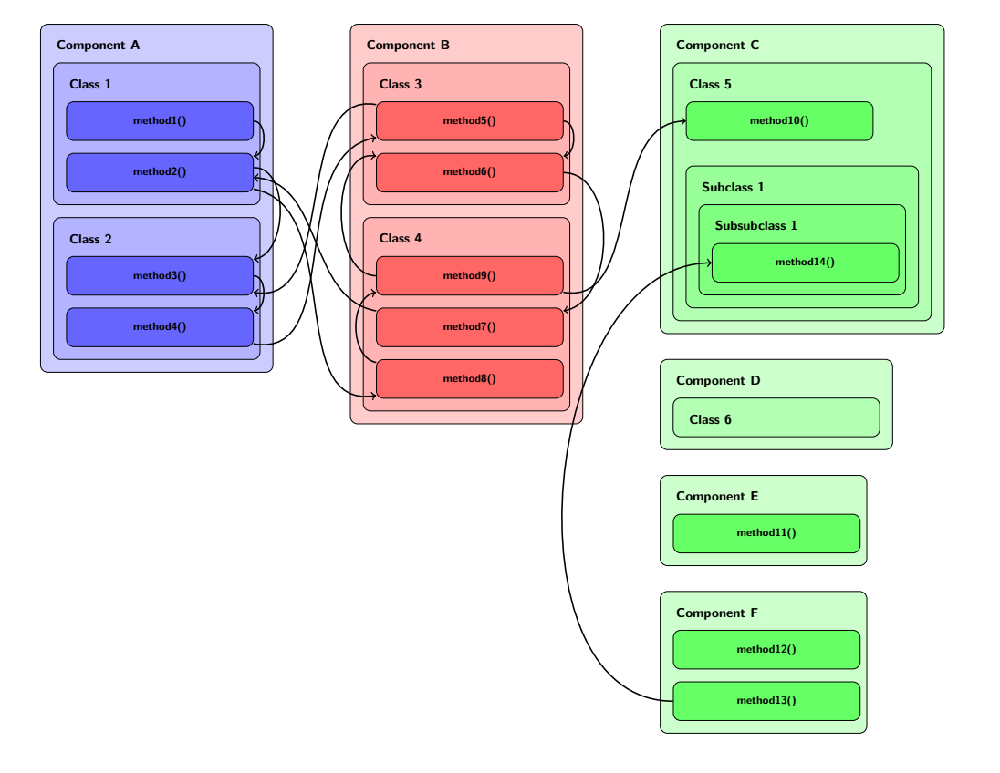

# Architexture Component Diagram Maker
Simple tool to visualize dataflow, i.e. how components of a program architecture interact.

## Example Output:

## How to Use:
Architecture is defined via an xml-file, see `example.xml` for an example.
- The architecture is:
  - a set of *components*, which can have further sub-*components* and *methods*,
  - a set of *actions*, that connect *methods* via their *ids*.
- components and methods also have an *order-number*, that defines their spacial placement:
  - on the first level of xml-components, the elements are ordered left-to-right,
  - in all further levels, the elements are ordered top-to-bottom.

Run `main.py` to construct a tex-file from the architexture specified in `example.xml` (adjust the code to use a different xml as source).
You have to manually compile the tex-file into pdf to get the diagram.

Code is written in Python 3.
